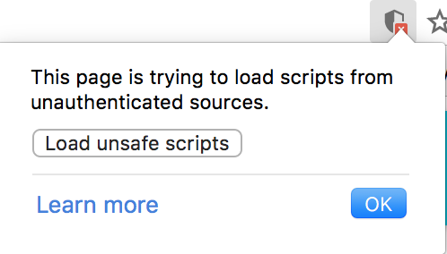

# local-weather-react
> FreeCodeCamp Challenge: [Local Weather App](https://petermbenjamin.github.io/local-weather-react/)

This is a rather naive and unpolished implementation of the FreeCodeCamp [Local Weather App](https://www.freecodecamp.com/challenges/show-the-local-weather) challenge

See [demo](https://petermbenjamin.github.io/local-weather-react/).

## Usage

- Enter your [openweathermap.org](https://home.openweathermap.org/users/sign_up) **API Key**
  - To avoid hardcoding API keys into the application, I've opted to ask the user for their own API Key. You can create one for free from [openweathermap.org](https://home.openweathermap.org/users/sign_up)
- Enter your **Zip Code**
- Select between **Metric** (e.g. Celsius) or **Imperial** (e.g. Fahrenheit) units
- Hit **Submit**

## Development

```sh
npm install
npm start
```

## Note

The [openweathermap.org API](http://openweathermap.org/current) is served over HTTP only whereas GitHub pages are served over HTTPS.  
This causes Chrome to throw error message:
```
Mixed Content: The page at 'https://petermbenjamin.github.io/local-weather-react/' was loaded over HTTPS, but requested an insecure resource 'http://api.openweathermap.org/data/2.5/weather?...'. This request has been blocked; the content must be served over HTTPS.
```
To get around this in Chrome, click on the **shield** icon and click `Load Unsafe Scripts`

